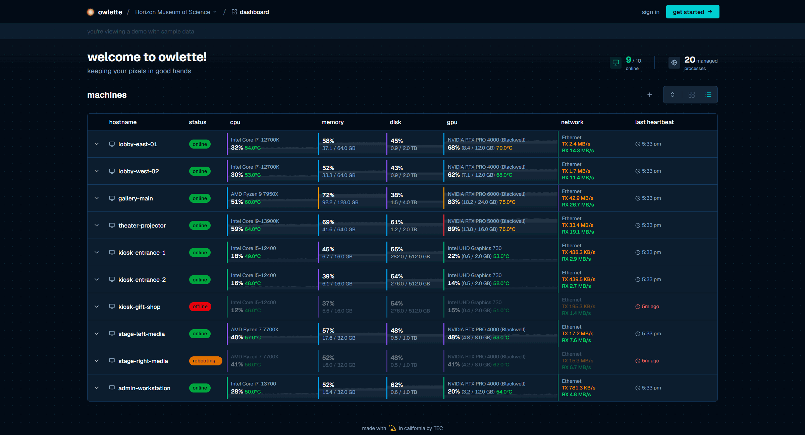
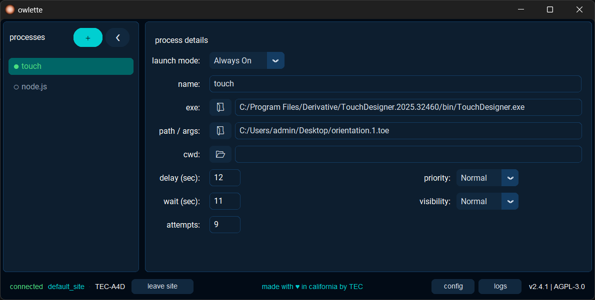

<div align="center">


# Owlette

### AI-Powered Fleet Management for Windows Applications

[](https://github.com/theexperiential/Owlette/releases)
[](LICENSE)
[](https://owlette.app)

[Live App](https://owlette.app) &nbsp;&bull;&nbsp; [Documentation](https://theexperiential.github.io/owlette/) &nbsp;&bull;&nbsp; [Download Agent](https://owlette.app/download)

</div>

---

Owlette is a cloud-connected system for monitoring, managing, and deploying software across fleets of Windows machines — from anywhere. A lightweight Python agent runs on each machine as a Windows service, reporting metrics and executing commands. A modern web dashboard gives you real-time visibility and control over your entire fleet, backed by Firebase and Cloud Firestore.

Built for teams running **digital signage**, **media servers**, **kiosks**, **TouchDesigner installations**, and any Windows application that needs to stay running.

<div align="center">

<p><em>Real-time fleet monitoring and control from the Owlette web dashboard</em></p>
</div>

## Features

**Real-Time Monitoring**
Live CPU, memory, disk, GPU, and network metrics. Process health tracking with crash detection. Remote screenshots and live view. Historical metrics with sparkline charts.

**Remote Deployment**
Push software silently to any number of machines. Supports NSIS, InnoSetup, MSI, and custom installers. Save deployment templates, track progress in real-time, and cancel mid-install.

**Cortex AI**
LLM-powered fleet management with natural language. AI executes commands on agents via tool-calling across 3 tiers — from read-only diagnostics to privileged operations. Screenshot analysis, autonomous crash investigation, and multi-provider support (Anthropic + OpenAI).

**Multi-Site Management**
Organize machines by location, department, or project. Role-based access control with site-level permissions. Multi-user accounts with admin and user roles.

**Project Distribution**
Sync project files (ZIPs, .toe files, media assets) across your fleet from any URL — Dropbox, Google Drive, your own hosting. Zero infrastructure cost. Automatic extraction and file verification.

**Alerts & Notifications**
Configurable threshold alerts for system metrics. Email notifications with branded templates. Webhook integrations for external platforms. Activity logging across your entire fleet.

> **[Full documentation →](https://theexperiential.github.io/owlette/)**

## Architecture

All communication flows through Cloud Firestore — there is no direct connection between agents and the dashboard. Firestore acts as the message bus.

```
┌─────────────────┐                                    ┌─────────────────┐
│  Agent           │     ┌──────────────────────┐      │  Web Dashboard   │
│  (Machine A)     │────▶│                      │◀─────│  (Next.js)       │
│                  │     │   Cloud Firestore     │      │                  │
│  Agent           │────▶│   (Real-time NoSQL)   │─────▶│  Users connect   │
│  (Machine B)     │     │                      │      │  via browser     │
│                  │◀────│                      │      │                  │
│  Agent           │     └──────────────────────┘      └─────────────────┘
│  (Machine C)     │              │
└─────────────────┘              │
                          ┌──────────────┐
                          │  Firebase     │
                          │  Auth         │
                          └──────────────┘
```

- **Agent** — Python Windows service. Monitors processes every 10s, sends heartbeats every 30s, reports metrics every 60s, executes commands, works offline.
- **Dashboard** — Next.js 16 web app. Real-time Firestore listeners, 63+ API endpoints, OpenAPI documentation.
- **Firestore** — Real-time NoSQL database. All data sync, command relay, and state management.
- **Cortex AI** — LLM chat with tool-calling capabilities relayed through Firestore to agents.

## Quick Start

### Hosted (Fastest)

1. Create an account at [owlette.app](https://owlette.app)
2. Create a **site** to organize your machines
3. Download the agent installer from the dashboard
4. Run the installer on your target Windows machine
5. A **3-word pairing phrase** appears — authorize it from the dashboard or your phone
6. Your machine appears in the dashboard within 30 seconds

### Self-Host

**Agent (Windows Service):**
```bash
git clone https://github.com/theexperiential/Owlette.git
cd Owlette/agent
pip install -r requirements.txt
cd src && python owlette_gui.py          # Configure and authenticate
python owlette_service.py install && python owlette_service.py start
```

**Web Dashboard:**
```bash
cd Owlette/web
npm install
cp .env.example .env.local               # Configure Firebase credentials
npm run dev                               # http://localhost:3000
```

> **[Full setup guide →](https://theexperiential.github.io/owlette/getting-started/)**

## Screenshots

<div align="center">


<p><em>Web dashboard — monitor machines, manage processes, deploy software</em></p>

<br/>


<p><em>Windows agent — system tray application with configuration GUI</em></p>

</div>

## Tech Stack

| Component | Technology |
|-----------|-----------|
| **Dashboard** | Next.js 16, React 19, TypeScript, Tailwind CSS 4, shadcn/ui |
| **Agent** | Python 3.9+, Windows Service (NSSM), psutil, CustomTkinter |
| **Database** | Cloud Firestore (real-time NoSQL) |
| **Auth** | Firebase Auth, WebAuthn/Passkeys, TOTP 2FA, device code pairing |
| **AI** | Anthropic + OpenAI via AI SDK, MCP tool-calling |
| **Email** | Resend (branded dark-theme templates) |
| **Hosting** | Railway (web), Firebase (backend) |

## Documentation

Full documentation is available at **[theexperiential.github.io/owlette](https://theexperiential.github.io/owlette/)**.

- [Getting Started](https://theexperiential.github.io/owlette/getting-started/) — First machine in under 5 minutes
- [Agent Guide](https://theexperiential.github.io/owlette/agent/) — Installation, configuration, system tray, troubleshooting
- [Dashboard Guide](https://theexperiential.github.io/owlette/dashboard/) — Monitoring, process management, views
- [Remote Deployment](https://theexperiential.github.io/owlette/dashboard/deployments/) — Silent software installation across machines
- [Project Distribution](https://theexperiential.github.io/owlette/dashboard/project-distribution/) — Sync project files across your fleet
- [Cortex AI & Tools](https://theexperiential.github.io/owlette/reference/cortex-tools/) — AI capabilities and tool reference
- [API Reference](https://theexperiential.github.io/owlette/reference/api/) — 63+ endpoints with OpenAPI docs
- [Architecture](https://theexperiential.github.io/owlette/architecture/) — System design and data flow
- [Authentication](https://theexperiential.github.io/owlette/reference/authentication/) — Auth methods, device code pairing, tokens

## Contributing

Contributions are welcome! Please open an issue or submit a pull request.

**Guidelines:**
- Fork the repo and create a feature branch from `dev`
- Use [conventional commits](https://www.conventionalcommits.org/) (`feat:`, `fix:`, `docs:`, etc.)
- Run tests before submitting: `cd web && npm test`
- Use `node scripts/sync-versions.js X.Y.Z` for version bumps
- All PRs merge to `dev` first, then `dev` → `main` for production

**[Open an issue →](https://github.com/theexperiential/Owlette/issues)**

## License

This project is licensed under the [GNU Affero General Public License v3.0](LICENSE) (AGPL-3.0). If you run a modified version of Owlette as a network service, you must make your source code available to users of that service.
