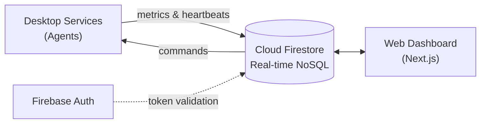
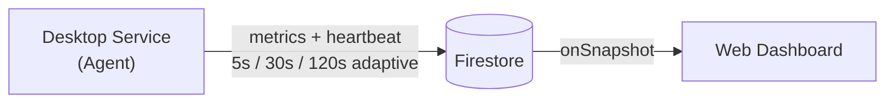
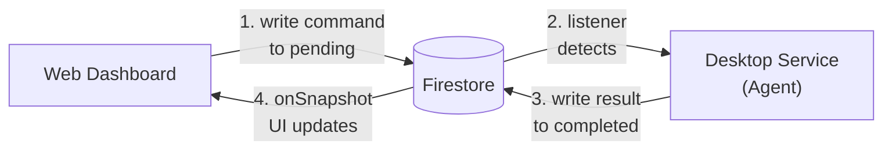
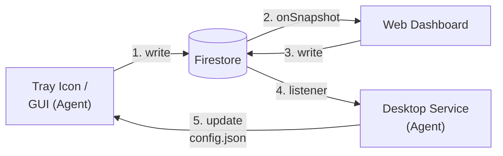
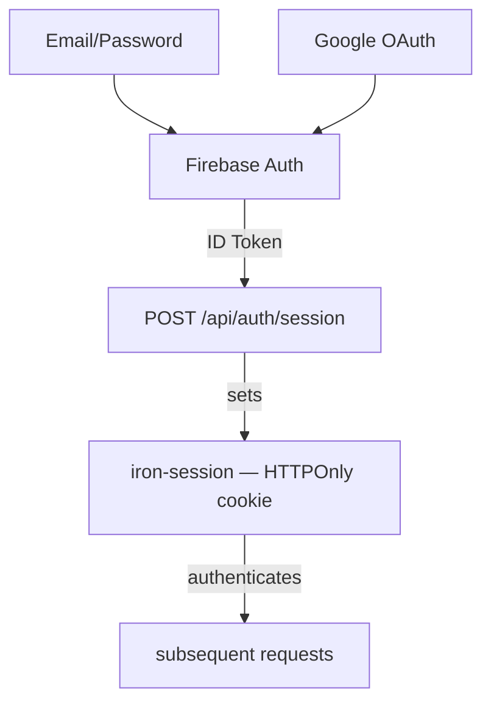
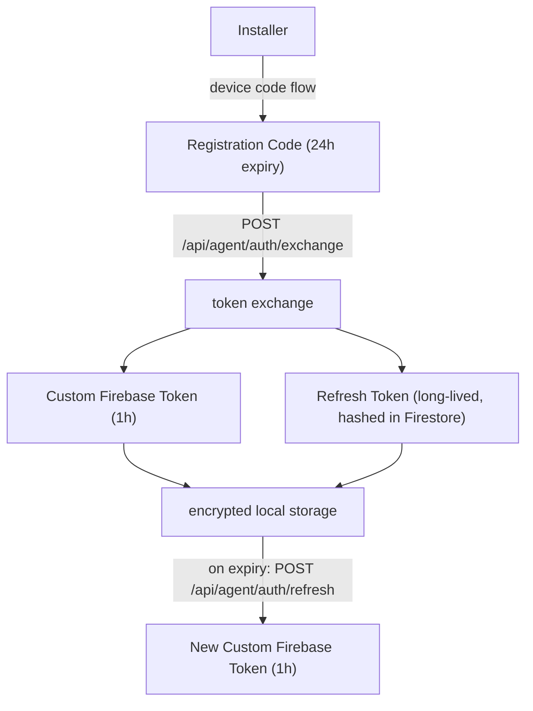
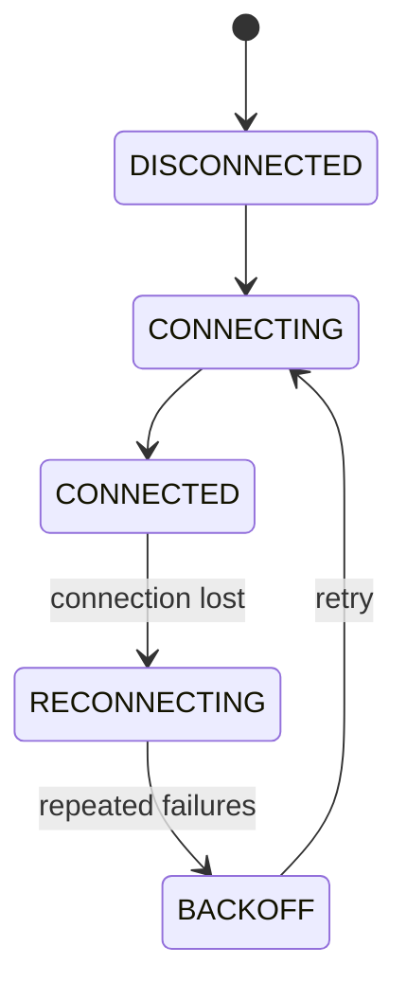

# architecture

owlette uses a serverless, event-driven architecture where all communication flows through Cloud Firestore. There is no direct connection between agents and the dashboard — Firestore acts as the message bus.

---

## system overview

---

## components

### python agent (windows service)

The agent runs as a Windows service managed by [NSSM](https://nssm.cc/) (Non-Sucking Service Manager). It:

- **Monitors processes** every 5 seconds — detects crashes, stalls, and exits
- **Auto-restarts** crashed applications using Task Scheduler or CreateProcessAsUser
- **Sends heartbeats & reports metrics** (CPU, memory, disk, GPU, network) at an adaptive interval — 5s when the system tray GUI is open, 30s when processes are running, 120s when idle
- **Executes commands** from the dashboard — restart process, install software, reboot, etc.
- **Syncs configuration** bidirectionally between local GUI and cloud
- **Runs offline** — continues monitoring even without internet, syncs when reconnected

The agent uses a **custom Firestore REST API client** (not the Firebase Admin SDK) with an OAuth two-token authentication system.

!!! info "Key directories"
    - **Installation**: `C:\ProgramData\Owlette\`
    - **Agent code**: `C:\ProgramData\Owlette\agent\src\`
    - **Logs**: `C:\ProgramData\Owlette\logs\`
    - **Config**: `C:\ProgramData\Owlette\agent\config\config.json`

### web dashboard (next.js)

The dashboard is a Next.js 16 application deployed to Railway. It:

- **Displays real-time data** using Firestore `onSnapshot` listeners
- **Manages processes** — add, edit, remove, start, stop, kill
- **Deploys software** — push installers to machines with progress tracking
- **Distributes projects** — sync ZIP files across the fleet
- **Manages users** — role-based access control with site-level permissions
- **Provides Cortex** — AI chat interface for machine interaction, plus autonomous cluster management (auto-investigates crashes)

### firebase backend

Firebase provides two services:

- **Cloud Firestore** — Real-time NoSQL database for all data sync
- **Firebase Authentication** — User auth (email/password, Google OAuth) and agent auth (custom tokens)

There are no Cloud Functions or custom backend servers — the web dashboard's Next.js API routes handle server-side operations like token generation and email sending.

---

## data flow

### heartbeat & metrics

### command execution

### configuration sync

---

## two firebase clients

This is the most important architectural distinction:

| | Web Dashboard | Python Agent |
|---|---|---|
| **SDK** | Firebase Client SDK (`firebase/firestore`) | Custom REST client (`firestore_rest_client.py`) |
| **Auth** | Firebase Auth (email/password, Google OAuth) | OAuth two-token system (custom token + refresh token) |
| **Real-time** | `onSnapshot` listeners | Polling + Firestore listener thread |
| **Timestamps** | `serverTimestamp()` | REST API `timestampValue` format |

The agent does **not** use the Firebase Admin SDK or any official Firebase Python library. It uses a hand-built REST client that communicates with the Firestore v1 REST API directly. This keeps the agent lightweight and avoids the heavy `google-cloud-firestore` dependency.

---

## authentication architecture

### user authentication

### agent authentication (oauth)

!!! info "More details"
    See [Authentication Reference](reference/authentication.md) for the complete flow including MFA.

---

## security model

### site-based access control

All data is scoped to **sites**. Users can only access sites they are assigned to.

| Role | Access |
|------|--------|
| **User** | Sites listed in their `users/{uid}/sites` array |
| **Admin** | All sites |
| **Agent** | Single site + single machine (from custom token claims) |

### firestore security rules

Rules enforce access at the database level — no client-side bypass is possible:

- Users must be authenticated
- Site access checked via `hasSiteAccess(siteId)`
- Agents scoped by `site_id` and `machine_id` claims in their custom token
- Token collections (`agent_tokens`, `agent_refresh_tokens`) are server-side only

---

## offline resilience

The agent is designed to operate without internet:

1. **No connection** — Agent uses last cached `config.json`, continues monitoring processes locally
2. **Connection restored** — Agent reconnects automatically via `ConnectionManager` with exponential backoff
3. **Metrics buffered** — Heartbeats and metrics resume immediately on reconnection
4. **Commands queued** — Pending commands in Firestore are picked up when the agent comes back online

The `ConnectionManager` implements a state machine with circuit breaker logic — after repeated failures, the agent backs off exponentially (up to 5 minutes) before retrying:

---

## technology stack

| Layer | Technology |
|-------|-----------|
| **Agent** | Python 3.9+, pywin32, psutil, CustomTkinter, NSSM |
| **Web** | Next.js 16, React 19, TypeScript 5, Tailwind CSS 4 |
| **UI Components** | shadcn/ui (Radix UI), Recharts, Lucide React |
| **Database** | Cloud Firestore (real-time NoSQL) |
| **Auth** | Firebase Authentication, iron-session, TOTP (2FA) |
| **Email** | Resend API |
| **Hosting** | Railway (web), Windows Service via NSSM (agent) |
| **Build** | Inno Setup (agent installer), Nixpacks (web) |
| **AI** | Vercel AI SDK, Anthropic Claude / OpenAI |
