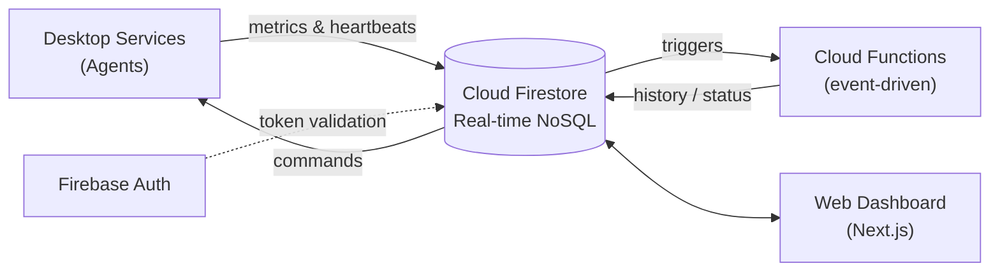
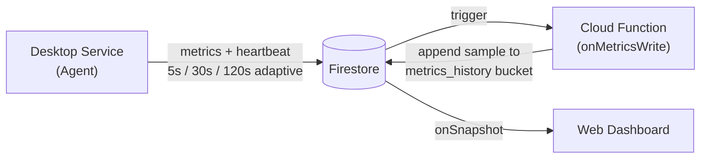
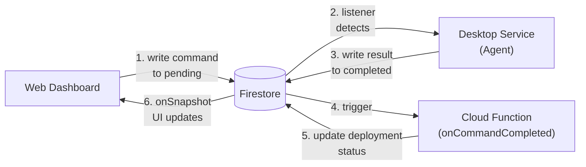
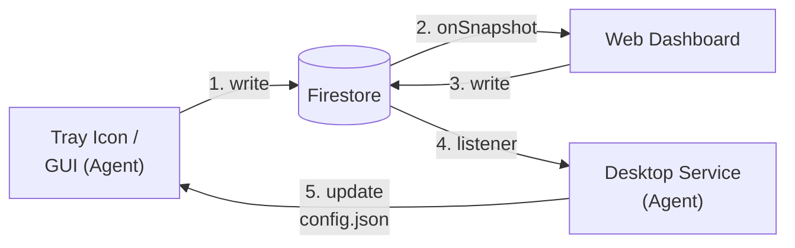
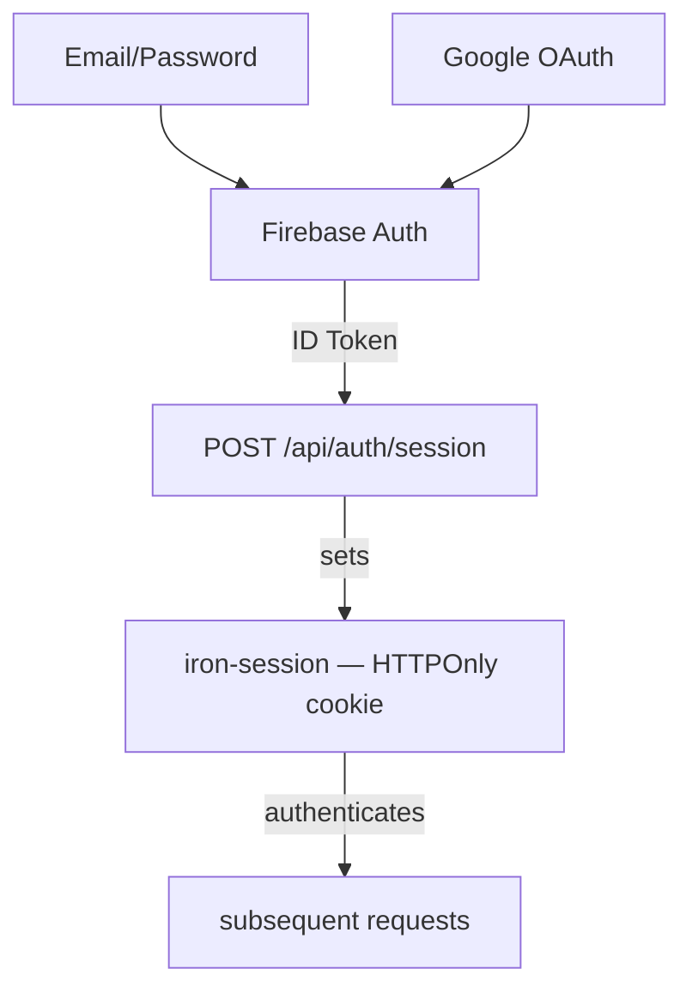
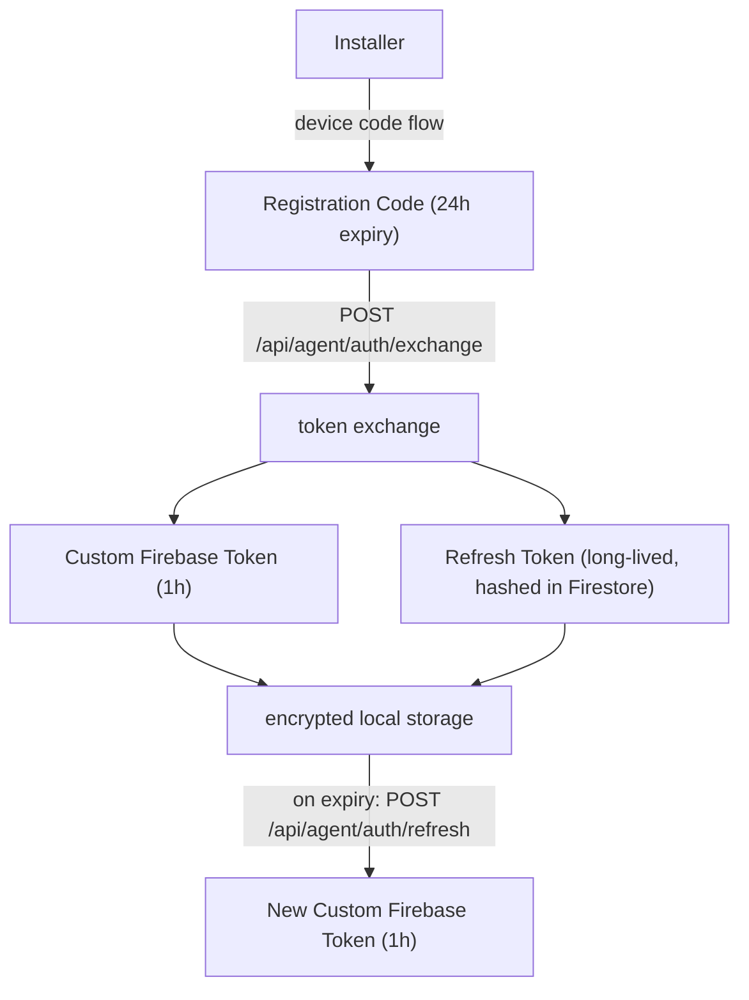
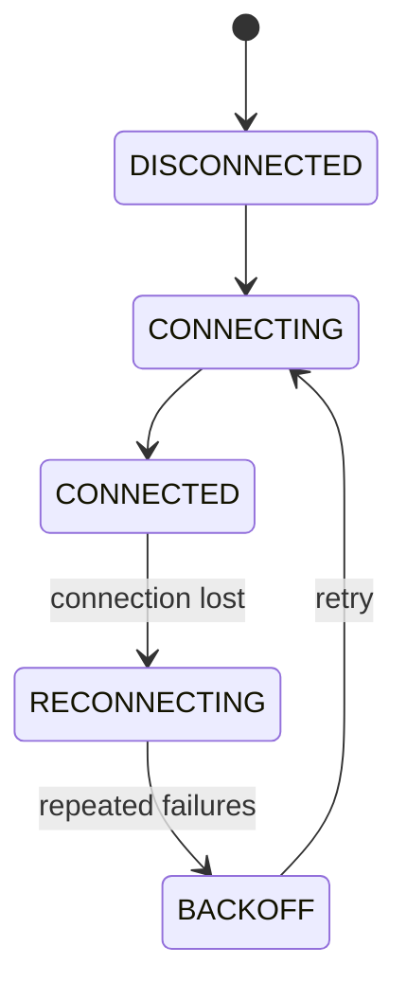

---
hide:
  - navigation
---

# architecture

owlette uses a serverless, event-driven architecture where all communication flows through Cloud Firestore. There is no direct connection between agents and the dashboard — Firestore acts as the message bus.

---

## system overview



---

## components

### python agent (windows service)

The agent runs as a Windows service managed by [NSSM](https://nssm.cc/) (Non-Sucking Service Manager). It:

- **Monitors processes** every 5 seconds — detects crashes, stalls, and exits
- **Auto-restarts** crashed applications using Task Scheduler or CreateProcessAsUser
- **Sends heartbeats & reports metrics** (CPU, memory, disk, GPU, network) at an adaptive interval — 5s when the system tray GUI is open, 30s when processes are running, 120s when idle
- **Executes commands** from the dashboard — restart process, install software, reboot, etc.
- **Syncs configuration** bidirectionally between local GUI and cloud
- **Runs offline** — continues monitoring even without internet, syncs when reconnected

The agent uses a **custom Firestore REST API client** (not the Firebase Admin SDK) with an OAuth two-token authentication system.

!!! info "Key directories"
    - **Installation**: `C:\ProgramData\Owlette\`
    - **Agent code**: `C:\ProgramData\Owlette\agent\src\`
    - **Logs**: `C:\ProgramData\Owlette\logs\`
    - **Config**: `C:\ProgramData\Owlette\agent\config\config.json`

### web dashboard (next.js)

The dashboard is a Next.js 16 application deployed to Railway. It:

- **Displays real-time data** using Firestore `onSnapshot` listeners
- **Manages processes** — add, edit, remove, start, stop, kill
- **Deploys software** — push installers to machines with progress tracking
- **Distributes projects** — sync ZIP files across the fleet
- **Manages users** — role-based access control with site-level permissions
- **Provides Cortex** — AI chat interface for machine interaction, plus autonomous cluster management (auto-investigates crashes)

### firebase backend

Firebase provides three services:

- **Cloud Firestore** — real-time NoSQL database for all data sync
- **Firebase Authentication** — user auth (email/password, Google OAuth) and agent auth (custom tokens)
- **Cloud Functions (2nd Gen)** — event-driven server-side logic (see below)

the web dashboard's Next.js API routes handle most server-side operations (token generation, email sending, API endpoints). Cloud Functions handle event-driven tasks that must run in response to Firestore writes or on a schedule.

### cloud functions

three Cloud Functions run on Firebase (2nd Gen, Node.js 20). source: `functions/src/`.

| function | trigger | purpose |
|----------|---------|---------|
| **onMetricsWrite** | Firestore `onDocumentWritten` on `sites/{siteId}/machines/{machineId}` | appends a compact sample to the daily `metrics_history/{YYYY-MM-DD}` bucket (per-CPU, per-disk usage, per-volume disk IO, per-GPU, per-NIC). also evaluates threshold alert rules and fires notifications when breached. rate-limited to one sample per 55 seconds. each numeric field is `Number.isFinite()`-guarded so a single poisoned reading can't reject the whole sample write. |
| **onCommandCompleted** | Firestore `onDocumentWritten` on `sites/{siteId}/machines/{machineId}/commands/completed` | when an agent finishes a command with a `deployment_id`, updates the deployment target's status, progress, and timestamps. recalculates overall deployment status across all targets. |
| **sweepStaleDeployments** | Cloud Scheduler, every 5 minutes | catches deployments stuck in non-terminal states (agent crash, network loss). marks pending targets as failed after 15 min, downloading/installing targets after 30 min. |

**deployment:**

```bash
# deploy all functions
cd functions && firebase deploy --only functions

# deploy a single function
firebase deploy --only functions:onMetricsWrite

# check which project is active
firebase use
# dev: owlette-dev-3838a | prod: owlette-prod-XXXXX
```

**environment:** `functions/.env` contains `CORTEX_INTERNAL_SECRET` (shared secret for internal API auth, must match `web/.env.local`). `API_BASE_URL` is auto-derived from the Firebase project ID.

---

## data flow

### heartbeat & metrics



### command execution



### configuration sync



### per-volume disk IO

The disk subsystem reports two independent axes per logical volume, kept distinct in both the data path and the dashboard UI:

- **storage** — capacity used %, sourced from `psutil.disk_usage()`. Slow-moving, near-100 on long-running machines.
- **activity** — read/write throughput as a percentage of the volume's max bandwidth, sourced from WMI's `Win32_PerfFormattedData_PerfDisk_LogicalDisk`. Spiky, near-zero most of the time.

Each volume's `maxBps` is established at first call by querying `MSFT_PhysicalDisk` for its hardware class (NVMe ≈ 3.5 GB/s, SATA SSD ≈ 550 MB/s, HDD ≈ 150 MB/s, etc.) and ratcheted upward by observed peaks — without this estimate the chart Y-axis would have no meaningful upper bound.

Two operational quirks shape the implementation:

1. **WMI watchdog (10s)** — the perflib `LogicalDisk` provider stalls for several seconds when the BITS service flips state during Windows Update / Delivery Optimization polling. A 2s or 5s budget reproducibly skipped these stalls (~3.6 timeouts/hr); 10s captures them at zero observed timeouts. The disk IO collector runs in its own thread so the worst-case wait never blocks the main metrics loop. (A persistent-WMI-worker variant was tried first but reproducibly triggered `RPC_E_WRONG_THREAD` on every call after the first — the python `wmi` package binds proxies to the apartment that created them, incompatible with reusing a cached proxy from a long-lived thread. The per-call pattern stays.)

2. **Volume filter** — raw `HarddiskVolumeN` partitions (no drive-letter mapping) are dropped at the agent before they reach Firestore, keeping the dashboard's volume list to user-meaningful drive letters.

`onMetricsWrite` flattens per-volume readings into history samples under `sample.dios = [{i, rb, wb, mb}]` — volume id, read bytes/s, write bytes/s, and the `maxBps` in effect at that moment (preserved per-sample so historical scaling stays correct after the ratchet has moved).

---

## two firebase clients

This is the most important architectural distinction:

| | web dashboard | python agent |
|---|---|---|
| **SDK** | Firebase Client SDK (`firebase/firestore`) | Custom REST client (`firestore_rest_client.py`) |
| **Auth** | Firebase Auth (email/password, Google OAuth) | OAuth two-token system (custom token + refresh token) |
| **Real-time** | `onSnapshot` listeners | Polling + Firestore listener thread |
| **Timestamps** | `serverTimestamp()` | REST API `timestampValue` format |

The agent does **not** use the Firebase Admin SDK or any official Firebase Python library. It uses a hand-built REST client that communicates with the Firestore v1 REST API directly. This keeps the agent lightweight and avoids the heavy `google-cloud-firestore` dependency.

---

## authentication architecture

### user authentication



### agent authentication (oauth)



!!! info "More details"
    See [Authentication Reference](reference/authentication.md) for the complete flow including MFA.

---

## security model

### site-based access control

All data is scoped to **sites**. Users can only access sites they are assigned to.

| role | access |
|------|--------|
| **User** | Sites listed in their `users/{uid}/sites` array |
| **Admin** | All sites |
| **Agent** | Single site + single machine (from custom token claims) |

### firestore security rules

Rules enforce access at the database level — no client-side bypass is possible:

- Users must be authenticated
- Site access checked via `hasSiteAccess(siteId)`
- Agents scoped by `site_id` and `machine_id` claims in their custom token
- Token collections (`agent_tokens`, `agent_refresh_tokens`) are server-side only

---

## offline resilience

The agent is designed to operate without internet:

1. **No connection** — Agent uses last cached `config.json`, continues monitoring processes locally
2. **Connection restored** — Agent reconnects automatically via `ConnectionManager` with exponential backoff
3. **Metrics buffered** — Heartbeats and metrics resume immediately on reconnection
4. **Commands queued** — Pending commands in Firestore are picked up when the agent comes back online

The `ConnectionManager` implements a state machine with circuit breaker logic — after repeated failures, the agent backs off exponentially (up to 5 minutes) before retrying:



---

## technology stack

| layer | technology |
|-------|-----------|
| **Agent** | Python 3.9+, pywin32, psutil, CustomTkinter, NSSM |
| **Web** | Next.js 16, React 19, TypeScript 5, Tailwind CSS 4 |
| **UI Components** | shadcn/ui (Radix UI), Recharts, Lucide React |
| **Database** | Cloud Firestore (real-time NoSQL) |
| **Auth** | Firebase Authentication, iron-session, TOTP (2FA) |
| **Email** | Resend API |
| **Cloud Functions** | Firebase Functions (2nd Gen, Node.js 20) |
| **Hosting** | Railway (web), Windows Service via NSSM (agent) |
| **Build** | Inno Setup (agent installer), Nixpacks (web) |
| **AI** | Vercel AI SDK, Anthropic Claude / OpenAI |
