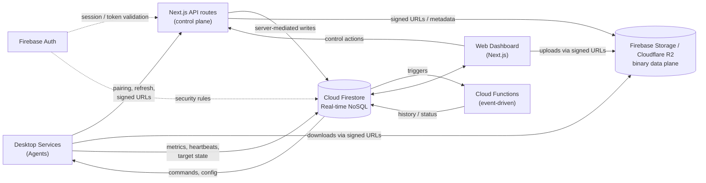
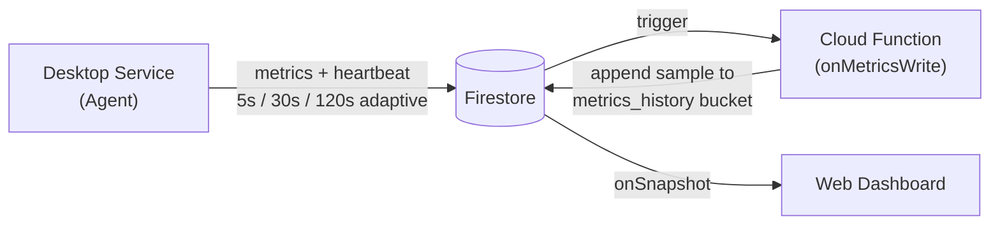
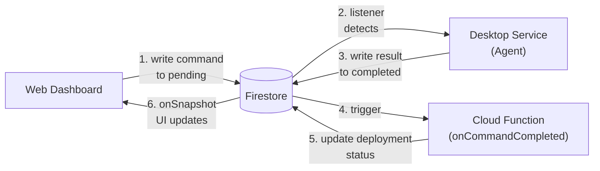
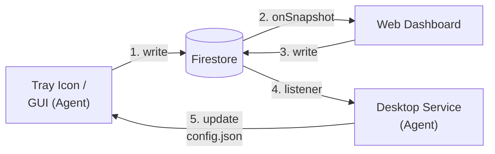
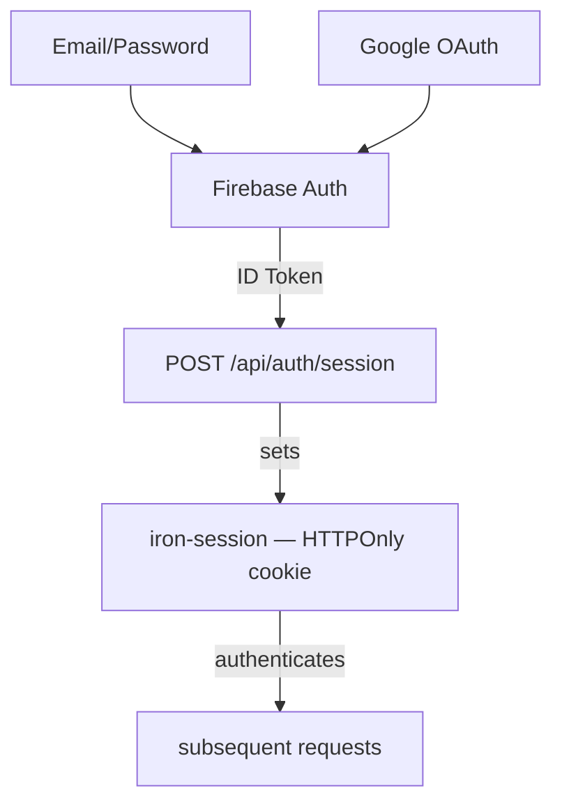
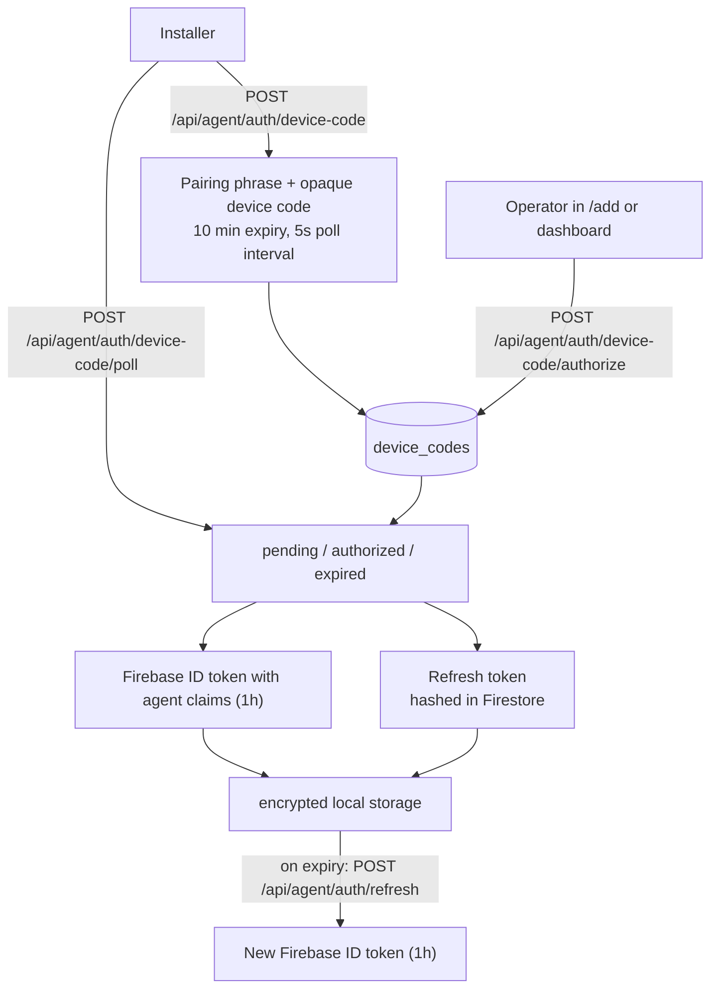
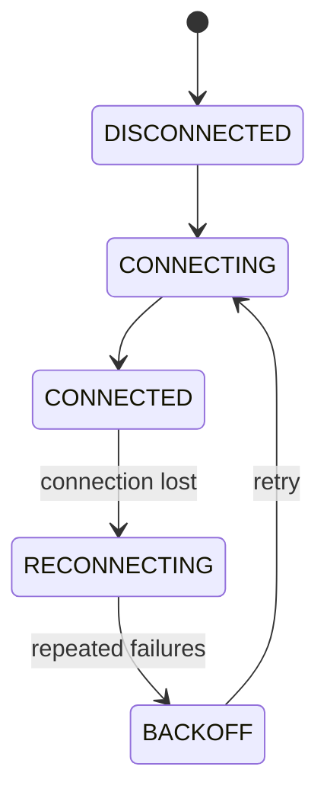
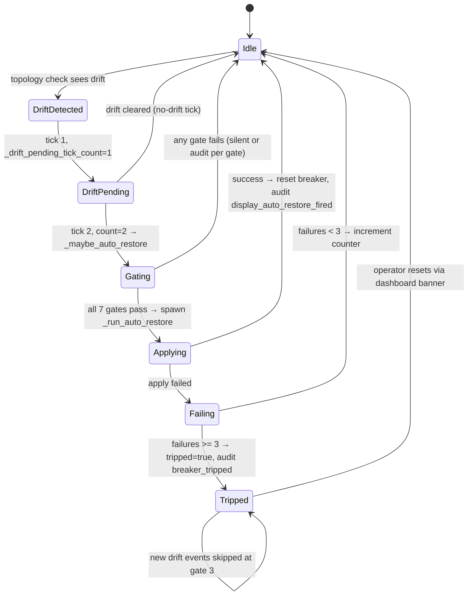
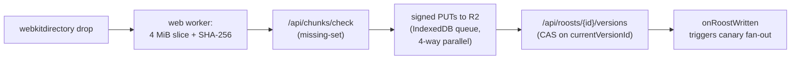
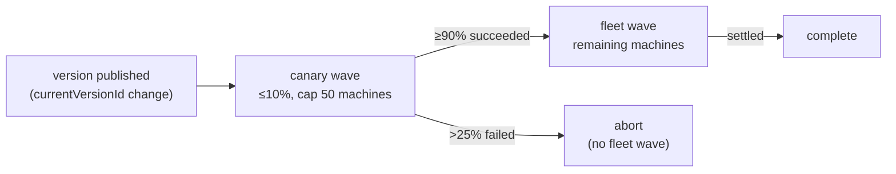

---
hide:
  - navigation
---

# architecture

owlette uses a split control, state, and data plane. Cloud Firestore is the real-time state store and command queue, Next.js API routes handle authenticated control actions, and object storage carries large binaries plus roost chunks and version bodies. Agents and the dashboard do not maintain a direct persistent connection to each other; they coordinate through API routes, Firestore state, and signed storage URLs.

---

## system overview



---

## components

### python agent (windows service)

The agent runs as a Windows service managed by [NSSM](https://nssm.cc/) (Non-Sucking Service Manager). It:

- **Monitors processes** every 5 seconds — detects crashes, stalls, and exits
- **Auto-restarts** crashed applications using Task Scheduler or CreateProcessAsUser
- **Sends heartbeats & reports metrics** (CPU, memory, disk, GPU, network) at an adaptive interval — 5s when the system tray GUI is open, 30s when processes are running, 120s when idle
- **Executes commands** from the dashboard — restart process, install software, reboot, etc.
- **Syncs configuration** bidirectionally between local GUI and cloud
- **Runs offline** — continues monitoring even without internet, syncs when reconnected

The agent uses a **custom Firestore REST API client** (not the Firebase Admin SDK) with an OAuth two-token authentication system.

!!! info "Key directories"
    - **Installation**: `C:\ProgramData\Owlette\`
    - **Agent code**: `C:\ProgramData\Owlette\agent\src\`
    - **Logs**: `C:\ProgramData\Owlette\logs\`
    - **Config**: `C:\ProgramData\Owlette\config\config.json`

### web dashboard (next.js)

The dashboard is a Next.js 16 application deployed to Railway. It:

- **Displays real-time data** using Firestore `onSnapshot` listeners
- **Manages processes** — add, edit, remove, start, stop, kill
- **Deploys software** — push installers to machines with progress tracking
- **Publishes roost versions** — content-addressed project sync through R2 chunks, immutable version history, resync, and rollback
- **Manages users** — role-based access control with site-level permissions
- **Provides Cortex** — AI chat interface for machine interaction, plus autonomous cluster management (auto-investigates crashes)

### firebase backend

Firebase provides the shared platform services:

- **Cloud Firestore** — real-time state, command queues, machine metrics, roost pointers, and site data
- **Firebase Authentication** — user auth (email/password, Google OAuth) and agent auth (custom tokens)
- **Firebase Storage** — installer binaries, screenshot objects, and other Firebase-backed downloads
- **Cloud Functions (2nd Gen)** — Firestore-triggered and scheduled server-side jobs (see below)

The web dashboard's Next.js API routes handle most control-plane operations: session creation, agent pairing and refresh, server-mediated writes, public API endpoints, email sending, and signed URL issuance. Cloud Functions handle event-driven tasks that must run in response to Firestore writes or on a schedule.

### cloud functions

Cloud Functions run on Firebase (2nd Gen, Node.js 20). The exported inventory is defined in `functions/src/index.ts` and grouped by purpose below.

| function | trigger | purpose |
|----------|---------|---------|
| **onMetricsWrite** | Firestore `onDocumentWritten` on `sites/{siteId}/machines/{machineId}` | appends a compact sample to the daily `metrics_history/{YYYY-MM-DD}` bucket (per-CPU, per-disk usage, per-volume disk IO, per-GPU, per-NIC). also evaluates threshold alert rules and fires notifications when breached. rate-limited to one sample per 55 seconds. each numeric field is `Number.isFinite()`-guarded so a single poisoned reading can't reject the whole sample write. |
| **onCommandCompleted** | Firestore `onDocumentWritten` on `sites/{siteId}/machines/{machineId}/commands/completed` | when an agent finishes a command with a `deployment_id`, updates the deployment target's status, progress, and timestamps. recalculates overall deployment status across all targets. |
| **sweepStaleDeployments** | Cloud Scheduler, every 5 minutes | catches deployments stuck in non-terminal states (agent crash, network loss). marks pending targets as failed after 15 min, downloading/installing targets after 30 min. |
| **onRoostWritten** | Firestore `onDocumentWritten` on `sites/{siteId}/roosts/{roostId}` | roost fan-out. detects `currentVersionId` change, partitions targets into canary + fleet cohorts (stable hash, <=10% / cap 50 canary), creates the rollout state doc, and dispatches canary `sync_pull` commands. |
| **onTargetStateWritten** | Firestore `onDocumentWritten` on `sites/{siteId}/roosts/{roostId}/target_state/{machineId}` | roost rollout state machine. transactional canary→fleet promotion on ≥90% success, abort on >25% failure (mid-wave, not waiting for full settlement). |
| **verifyChunk** | HTTPS request | roost integrity check. streams an R2 chunk, computes SHA-256, deletes + alerts on hash mismatch (planted-bytes defense). invoked via Cloudflare Worker webhook on every R2 PUT. |
| **chunkGcNightly** | Cloud Scheduler, 02:15 UTC | roost chunk garbage collection. two-phase mark-and-sweep with 30-day tombstone TTL, resurrection guard (a chunk re-referenced between mark and sweep has its tombstone cleared), pause-during-publish. `CHUNK_GC_MODE=dry-run` default. |
| **preUploadCheck** + **reconcileQuota** | HTTPS + Cloud Scheduler (03:45 UTC) | roost per-tenant quota. pre-upload admit reserves pending bytes atomically; daily reconcile re-reads authoritative usage, fires only newly-crossed 50/80/100% alarms. |
| **aggregateTelemetry** + **recordUsageEvent** + **getUsageSummaryHttp** | Cloud Scheduler (04:30 UTC) + HTTPS | roost telemetry. per-tenant cost attribution against R2 pricing ($0.015/GB-month, $4.50/M class-A, $0.36/M class-B, $0 egress). OTLP-shaped structured logs for downstream collector. |
| **recordAuditEvent** + **exportAuditDaily** + **verifyAuditChain** | HTTPS + Cloud Scheduler (05:15 UTC) | roost append-only audit log. SHA-256 hash-chained records (tamper-evident by deletion + mutation), 7-year retention, BigQuery cold-storage sink at 05:15 UTC. |
| **exportSecurityBoundaryAuditDevDaily** | Cloud Scheduler, 06:30 UTC | exports security-boundary audit collections to the configured GCS audit bucket. |
| **emitWebhook** + **processRetryQueue** | HTTPS + Cloud Scheduler (every 1 minute) | roost webhook dispatcher. 7 event types (`distribution.queued/started/succeeded/failed`, `chunk.uploaded`, `manifest.published`, `rollback.executed`), HMAC-SHA256 signed (`sha256=<hex>`), exponential backoff retry (5 s base × 3 × 1 h cap × ±20% jitter, 10-attempt cap). |
| **sweepExpiredApiKeysDaily** | Cloud Scheduler, 03:00 UTC | marks expired user API keys so settings and API auth stop treating them as active. |
| **sweepExpiredIdempotencyCacheDaily** | Cloud Scheduler, 03:30 UTC | removes expired idempotency cache entries from `idempotency_cache/{hash}`. |

**deployment:**

```bash
# deploy all functions
cd functions && firebase deploy --only functions

# deploy a single function
firebase deploy --only functions:onMetricsWrite

# check which project is active
firebase use
# dev: owlette-dev-3838a | prod: owlette-prod-XXXXX
```

**environment:** `functions/.env` contains `CORTEX_INTERNAL_SECRET` (shared secret for internal API auth, must match `web/.env.local`). `API_BASE_URL` is auto-derived from the Firebase project ID.

---

## data flow

### heartbeat & metrics



### command execution



### configuration sync



### per-volume disk IO

The disk subsystem reports two independent axes per logical volume, kept distinct in both the data path and the dashboard UI:

- **storage** — capacity used %, sourced from `psutil.disk_usage()`. Slow-moving, near-100 on long-running machines.
- **activity** — read/write throughput as a percentage of the volume's max bandwidth, sourced from WMI's `Win32_PerfFormattedData_PerfDisk_LogicalDisk`. Spiky, near-zero most of the time.

Each volume's `maxBps` is established at first call by querying `MSFT_PhysicalDisk` for its hardware class (NVMe ≈ 3.5 GB/s, SATA SSD ≈ 550 MB/s, HDD ≈ 150 MB/s, etc.) and ratcheted upward by observed peaks — without this estimate the chart Y-axis would have no meaningful upper bound.

Two operational quirks shape the implementation:

1. **WMI watchdog (10s)** — the perflib `LogicalDisk` provider stalls for several seconds when the BITS service flips state during Windows Update / Delivery Optimization polling. A 2s or 5s budget reproducibly skipped these stalls (~3.6 timeouts/hr); 10s captures them at zero observed timeouts. The disk IO collector runs in its own thread so the worst-case wait never blocks the main metrics loop. (A persistent-WMI-worker variant was tried first but reproducibly triggered `RPC_E_WRONG_THREAD` on every call after the first — the python `wmi` package binds proxies to the apartment that created them, incompatible with reusing a cached proxy from a long-lived thread. The per-call pattern stays.)

2. **Volume filter** — raw `HarddiskVolumeN` partitions (no drive-letter mapping) are dropped at the agent before they reach Firestore, keeping the dashboard's volume list to user-meaningful drive letters.

`onMetricsWrite` flattens per-volume readings into history samples under `sample.dios = [{i, rb, wb, mb}]` — volume id, read bytes/s, write bytes/s, and the `maxBps` in effect at that moment (preserved per-sample so historical scaling stays correct after the ratchet has moved).

---

## two firebase clients

This is the most important architectural distinction:

| | web dashboard | python agent |
|---|---|---|
| **SDK** | Firebase Client SDK (`firebase/firestore`) | Custom REST client (`firestore_rest_client.py`) |
| **Auth** | Firebase Auth (email/password, Google OAuth) | OAuth two-token system (custom token + refresh token) |
| **Real-time** | `onSnapshot` listeners | Polling + Firestore listener thread |
| **Timestamps** | `serverTimestamp()` | REST API `timestampValue` format |

The agent does **not** use the Firebase Admin SDK or any official Firebase Python library. It uses a hand-built REST client that communicates with the Firestore v1 REST API directly. This keeps the agent lightweight and avoids the heavy `google-cloud-firestore` dependency.

---

## authentication architecture

### user authentication



### agent authentication (oauth)



!!! info "More details"
    See [Authentication Reference](reference/authentication.md) for the complete flow including MFA.

---

## security model

### site-based access control

All data is scoped to **sites**. Users can only access sites they are assigned to.

| role | access |
|------|--------|
| **Member** | Sites listed in their `users/{uid}/sites` array |
| **Admin** | Site-scoped admin for sites listed in `users/{uid}/sites` |
| **Superadmin** | All sites and platform-level operations |
| **Agent** | Single site + single machine (from custom token claims) |

### firestore security rules

Rules enforce access at the database level — no client-side bypass is possible:

- Users must be authenticated
- Site access checked via `canAccessSite(siteId)`
- Site-level elevated operations checked via `isSiteAdmin(siteId)`
- Platform-wide operations checked via `isSuperadmin()`
- Agents scoped by `site_id` and `machine_id` claims in their custom token and `agentCanAccessMachine(siteId, machineId)`
- Token collections (`agent_tokens`, `agent_refresh_tokens`) are server-side only

---

## offline resilience

The agent is designed to operate without internet:

1. **No connection** — Agent uses last cached `config.json`, continues monitoring processes locally
2. **Connection restored** — Agent reconnects automatically via `ConnectionManager` with exponential backoff
3. **Metrics buffered** — Heartbeats and metrics resume immediately on reconnection
4. **Commands queued** — Pending commands in Firestore are picked up when the agent comes back online

The `ConnectionManager` implements a state machine with circuit breaker logic. Retry backoff starts at 30 seconds, doubles with jitter, and caps at 1 hour. After enough consecutive failures the circuit opens; the first recovery probe is allowed after 5 minutes, while fatal-ish configuration errors still keep retrying on the 1-hour cadence.



---

## display layout management

owlette tracks per-machine monitor topology end-to-end: the agent enumerates the live config via Windows CCD, an operator can capture the current arrangement as the "stored" layout, and a recall command pushes the stored layout back when monitors drift. The dashboard panel lets operators edit stored layouts in-place; an opt-in auto-restore feature reapplies the stored layout automatically on detected drift.

### data model (machine-scoped)

| Firestore path | Owner | Purpose |
|---|---|---|
| `sites/{siteId}/machines/{machineId}/hardware/display` | agent | live topology snapshot — refreshed every 5 min and on topology-change events |
| `sites/{siteId}/machines/{machineId}/hardware/displayModes` | agent | per-`edidHash` supported-modes catalogue. on-demand: dashboard fires `enumerate_display_modes` when the editor opens, agent skips re-upload if `signatureHash` unchanged |
| `config/{siteId}/machines/{machineId}` (`displays.assigned`) | operator | the stored layout — `{monitors: MonitorInfo[], capturedAt, capturedBy}` |
| `config/{siteId}/machines/{machineId}` (`displays.autoRestore`) | mixed | `{enabled, enabledBy, enabledAt}` operator-set; `circuitBreaker.{tripped, failures, lastError, lastSuccessAt, lastFailureAt, trippedAt}` agent-set (operator can reset `tripped: false` + `failures: 0`) |
| `sites/{siteId}/logs` (`action.startsWith('display_')`) | agent | event audit log — each entry has `{action, level, machineId, details (json)}` |
| `pending_display_alerts/*` | web (`/api/agent/alert`) → cron | digest queue for non-critical-path display alerts |

### event taxonomy

10 audit-log actions emitted from `_emit_display_change_events` (in `agent/src/owlette_service.py`):

| event | trigger | severity |
|---|---|---|
| `display_monitor_added` | new edidHash in live not in prev | info |
| `display_monitor_removed` | prev edidHash gone from live | critical |
| `display_monitor_swapped` | same `targetId` reports a different `edidHash` | warning |
| `display_drift` | same `edidHash`, one or more tracked fields (position, resolution, refreshHz, rotation, scalePct, primary) changed | warning |
| `display_mosaic_disabled` | nvidia mosaic was active in prev, not in current | warning |
| `display_sync_lost` | gsync/framelock device that was `locked` in prev is no longer locked | warning |
| `display_apply_succeeded` | recall finished cleanly | info |
| `display_apply_failed` | sdc_validate or sdc_apply rejected | critical |
| `display_apply_refused_mosaic` | recall blocked because mosaic active | warning |
| `display_auto_revert_fired` | watchdog auto-reverted a recall (no operator ack within 30s) | critical |

The routing table at `web/lib/alerts/displayEventRouting.ts` is the single source of truth for which channel each event ships to (email, webhook, dashboard-only) — see the changelog for severity decisions.

### post-apply suppression window

The agent stamps `_last_apply_finished_at = time.time()` at the end of every successful apply (manual or auto-restore). When `_emit_display_change_events` runs within 90s of that timestamp, every event payload gets `suppressAlert: true` + `correlatedApplyId: <the apply's uuid>`. The `/api/agent/alert` route honors the flag: skips email digest queue, still fires webhook (receivers handle their own dedup). This eliminates the recall-then-N-drift-emails avalanche where a successful 8-monitor recall would otherwise emit 8 individual `display_drift` events as the OS settled.

### auto-restore — gate chain

`_maybe_auto_restore(new_profile)` runs the 7-gate chain in order. First failure exits early; only when all 7 pass does the function spawn `_run_auto_restore` on a daemon thread.

```
1. displays.enabled            (kill switch — operator-set; missing = enabled)
2. displays.autoRestore.enabled (per-machine opt-in — default false)
3. circuitBreaker.tripped       (false required)
4. _apply_in_flight             (false required — no concurrent manual apply)
5. drift fixable                (every drifted edidHash present in assigned.monitors)
                                — else: emit display_auto_restore_skipped_unfixable, return
6. _drift_pending_tick_count    (>= 2 — drift persisted across two 30s topology checks ≈ 60s)
7. apply cooldown               (time.time() - _last_apply_time >= _APPLY_COOLDOWN_SECONDS)
```

Gates 1–3 short-circuit silently (the operator already knows their config; no audit needed). Gate 5 emits the `display_auto_restore_skipped_unfixable` audit so the operator sees why the auto-fix didn't fire when a new monitor was plugged in. Gates 4, 6, 7 are silent — the next topology check tick will retry.

### auto-restore — fixability model

Only `display_drift` events trigger auto-restore. The other monitor-change events (`_added`, `_removed`, `_swapped`) are explicitly NOT wired into `_maybe_auto_restore` because they describe drift that re-applying the stored layout *can't fix*:

- **`_monitor_added`** — a new physical panel is in live but not in assigned. Re-applying assigned wouldn't change anything because the new monitor isn't referenced. Looping would fire the auto-restore cooldown forever with no change.
- **`_monitor_removed`** — the assigned monitor is unplugged. Windows can't apply a config that references an absent panel; SDC_VALIDATE would reject. Looping would burn the breaker on guaranteed-failure attempts.
- **`_monitor_swapped`** — same `targetId` now reports a different `edidHash`. The stored layout doesn't reference the new edidHash so the apply is unfixable in the same way as `_removed`.

For all three "unfixable" cases the operator gets the audit event in the dashboard events tab and (per the routing table) a webhook delivery — but no auto-restore attempt and no breaker increment.

### auto-restore — circuit breaker

`_run_auto_restore` writes the breaker state to `config/{siteId}/machines/{machineId}.displays.autoRestore.circuitBreaker` after each attempt:

- **success** → `{failures: 0, tripped: false, lastSuccessAt: <iso8601>}`
- **rate-limited** (`AUTO_RESTORE_RATE_LIMITED`) → no-op (skipped on purpose; not a real failure)
- **unfixable** (`AUTO_RESTORE_SKIPPED_UNFIXABLE`) → no-op (same)
- **other failure** → `{failures: <prev + 1>, lastFailureAt: <iso8601>, lastError: <truncated to 500 chars>}`. At `failures >= 3` also sets `{tripped: true, trippedAt: <iso8601>}` and emits `display_auto_restore_circuit_breaker_tripped` audit at error severity.

While `tripped: true`, gate 3 short-circuits subsequent `_maybe_auto_restore` calls — no thread spawned, no further failures counted. The dashboard panel's red banner offers a single-click reset (`tripped: false, failures: 0`); the next drift event after reset re-fires through the gate chain normally.

### state-machine reference



### in-process / firestore boundaries

Module-state held by `display_manager.py`: `_apply_in_flight`, `_apply_lock`, `_current_apply_id`, `_last_apply_time`, `_last_apply_finished_at`, `_ack_event`. These coordinate the apply path and the suppression window across threads but never touch Firestore directly — Firestore writes go through `firebase_client` helpers (`_ensure_display_profile`, `_ensure_display_modes_catalogue`, `update_display_autorestore_state`, `log_event`). Service-class state held by `OwletteService`: `_drift_pending_tick_count` (per-tick counter for the persistence gate). The `MockService` in `owlette_runner.py` mirrors every new instance attribute so NSSM-mode startup doesn't crash on a missing field.

---

## roost — content-addressed project distribution (v2)

roost replaces v1's single-URL-per-distribution model with a content-addressed sync layer. A synced folder maps to an immutable sequence of versions; flipping a roost's `currentVersionId` pointer is what triggers a deploy or rollback.

### why the model changed

v1 distribution was a one-shot download of a ZIP at a host-supplied URL. A one-byte change re-uploaded the whole archive, there was no rollback, and agents re-verified by re-downloading. roost fixes all three: content-addressed dedup transfers only changed bytes, rollback is an atomic pointer flip, and the version body is authoritative (chunks are validated by hash, with no separate verify-files list).

### storage layout

chunks are stored in **Cloudflare R2** at a per-tenant prefix:

```
project-content/{siteId}/{hash[0:2]}/{hash}
```

- `siteId` scopes per-customer, preventing cross-tenant access via signed-URL guessing
- `hash[0:2]` shards within a tenant so R2 listings don't bottleneck on a single prefix
- `hash` is the lowercase 64-char SHA-256 of the 4 MiB chunk

version bodies are stored at `project-manifests/{siteId}/{roostId}/{versionId}.json` (the R2 prefix keeps its legacy name), immutable once written. A Firestore pointer at `sites/{siteId}/roosts/{roostId}.currentVersionId` is the mutable head; `versionUrl` points at the current version body object.

### version body format

The version body is an OCI-derived JSON document with media type `application/vnd.owlette.version.v1+json`. It is canonical JSON and includes a `config` object plus a non-empty `files[]` array. Minimal shape:

```json
{
  "schemaVersion": 2,
  "mediaType": "application/vnd.owlette.version.v1+json",
  "config": { "name": "lobby-show", "siteId": "nyc", "createdAt": "...", "createdBy": "uid" },
  "files": [
    { "path": "project.toe", "size": 123456, "chunks": [
      { "hash": "a1b2...", "size": 4194304 }
    ]}
  ]
}
```

### upload pipeline (browser)



- chunker + hasher off the main thread ([web/lib/chunking.ts](../web/lib/chunking.ts), worker at `web/lib/workers/versionBuilder.worker.ts`)
- upload queue persists to IndexedDB ([web/lib/uploadQueue.ts](../web/lib/uploadQueue.ts)) — closing the tab at 50% and re-dropping the same folder resumes from 50%
- `admit` endpoint reserves `pendingBytes` atomically so concurrent uploads can't both fit when their sum would exceed quota
- finalize is a Firestore transaction — compare-and-swap on `currentVersionId` means concurrent finalizes serialise safely

### agent sync pipeline

Agents receive `sync_pull` commands from roost fan-out, manual deploy, resync, or rollback flows. `cancel_sync` can signal an in-flight pull to stop gracefully, and `rollback_to_version` reuses the same sync path after the server flips the pointer to an older immutable version.

1. **version fetch** ([agent/src/sync_version.py](../agent/src/sync_version.py)) — pull the version body from R2, cache it under `%PROGRAMDATA%\Owlette\versions\{versionId}.json`, and diff against the previous committed version to compute the chunk and file delta
2. **chunk download** ([agent/src/sync_downloader.py](../agent/src/sync_downloader.py)) — parallel workers (default 4) with `Range: bytes=<offset>-` resume, per-chunk SHA-256 verify, signed-URL refresh on 403
3. **atomic assembly** ([agent/src/sync_assembler.py](../agent/src/sync_assembler.py)) — write to `<path>.partial`, fsync, `os.replace` (atomic). post-rename realpath check guards against TOCTOU symlink-swap between the allowlist validation and the rename landing
4. **scrub** ([agent/src/sync_scrub.py](../agent/src/sync_scrub.py)) — periodic re-hashing of on-disk files against their manifest chunk hashes to catch silent bit rot

every write is gated by the **destination allowlist** ([agent/src/destination_allowlist.py](../agent/src/destination_allowlist.py)) — fail-closed: an empty or missing allowlist rejects all writes. symlinks, junctions, Windows reserved device names (NUL, CON, PRN…), alternate data streams, and paths outside the allowed roots are rejected with realpath resolution, not just string matching.

During sync, agents report per-target state to `sites/{siteId}/roosts/{roostId}/target_state/{machineId}` with statuses such as `pending`, `downloading`, `assembling`, `committed`, `failed`, and `cancelled`.

### rollout strategy (canary-first)

Every `currentVersionId` pointer flip goes through a **staged rollout** — never all-at-once. this is the standing cloudflare 2025-11-18 lesson in code form:



canary cohort selection is deterministic (FNV-1a hash of `machineId + versionId`) so trigger retries don't flap the chosen cohort. the abort threshold evaluates against `total`, not `settled`, so a rollout that's already past the 25% failure mark bails immediately without waiting for remaining machines.

### security floor

- **per-tenant signed-URL paths**: a signed URL issued for `site-a` cannot read `site-b`'s chunks — paths are scoped before signing
- **allowlist**: fail-closed at the agent; admin UI at `web/components/AllowlistEditor.tsx`
- **hash-chained audit log**: every `signed_url_issued` / `distribution_started` / `manifest_pointer_changed` / `api_key_used` / `gc_run` record embeds `hash(prev || canonicalPayload)` — tamper detection survives deletion + mutation
- **no-token-logs lint gate**: `scripts/check-no-token-logs.mjs` blocks any commit that logs auth tokens (CI + optional pre-commit)

### current agent support

The current checked-in agent version is `2.11.0`, and that agent registers the roost v2 handlers `sync_pull`, `cancel_sync`, and `rollback_to_version`. The v2 sync path does not use a `project_url` fallback; legacy v1 project-distribution records can coexist in Firestore during migration, but roost v2 deploys are consumed by agents with the v2 sync handlers.

---

## technology stack

| layer | technology |
|-------|-----------|
| **Agent** | Python 3.9+, pywin32, psutil, CustomTkinter, NSSM |
| **Web** | Next.js 16, React 19, TypeScript 5, Tailwind CSS 4 |
| **UI Components** | shadcn/ui (Radix UI), Recharts, Lucide React |
| **Database** | Cloud Firestore (real-time NoSQL) |
| **Object storage (roost)** | Cloudflare R2 (S3-compatible, free egress) |
| **Auth** | Firebase Authentication, iron-session, TOTP (2FA) |
| **Email** | Resend API |
| **Cloud Functions** | Firebase Functions (2nd Gen, Node.js 20) |
| **Hosting** | Railway (web), Windows Service via NSSM (agent) |
| **Build** | Inno Setup (agent installer), Nixpacks (web) |
| **AI** | Vercel AI SDK, Anthropic Claude / OpenAI |
