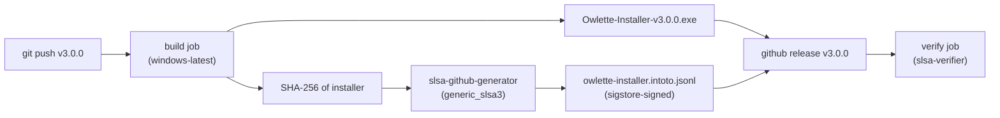

# SLSA Build Level 3 — installer provenance

**Wave 5.8.** Hermetic CI build of the roost agent installer with signed in-toto provenance, verifiable by anyone with `slsa-verifier`.

## What it proves

For any downloaded `Owlette-Installer-vX.Y.Z.exe`, a consumer can prove:

1. **Built from this repo** (`github.com/<org>/owlette`) at the exact commit pinned by the tag
2. **Built by this workflow** (`.github/workflows/build-installer.yml`) — not a human laptop
3. **Not tampered with post-build** — the signed hash in the attestation matches the artifact bytes
4. **Built after the source was committed** — the provenance's `finishedOn` timestamp post-dates the tag's commit

SLSA Build L3 is distinct from **authenticode signing** (wave 5.9), which protects against untrusted code execution on Windows. Both ship side-by-side on a released installer — SLSA proves provenance, authenticode unlocks SmartScreen.

## How it works



### The three-job isolation

1. **build** runs on `windows-latest`, produces the installer, outputs its hash. Cannot touch the signing key.
2. **provenance** runs in the `slsa-framework/slsa-github-generator` reusable workflow. It reads the hash from the build job's outputs, produces a signed in-toto attestation via sigstore + GitHub OIDC, uploads to the release. The build job cannot impersonate this — OIDC scoping prevents a malicious build step from claiming to be the generator.
3. **verify** runs `slsa-verifier` against the artifact + attestation as a smoke test before the release is considered final.

## Running a release

```bash
# 1. Update VERSION + changelog + commit (per CLAUDE.md)
node scripts/sync-versions.js 3.0.0
# edit docs/changelog.md, add [3.0.0] entry
git add -A && git commit -m "chore: bump version to 3.0.0"

# 2. Tag + push. The workflow triggers on tag push.
git tag v3.0.0
git push origin main --tags
```

The workflow then:
- Builds the installer on `windows-latest` via `agent/build_installer_full.bat`
- Generates in-toto provenance
- Attaches both to the GitHub release
- Runs `slsa-verifier` smoke to confirm the chain

## Verifying a downloaded installer

Anyone with a downloaded installer and the release URL can verify it:

```bash
# install slsa-verifier
go install github.com/slsa-framework/slsa-verifier/v2/cli/slsa-verifier@latest

# download both artifacts
gh release download v3.0.0 --repo <org>/owlette

# verify
slsa-verifier verify-artifact \
  Owlette-Installer-v3.0.0.exe \
  --provenance-path owlette-installer.intoto.jsonl \
  --source-uri github.com/<org>/owlette \
  --source-tag v3.0.0
```

Expected output: `PASSED: Verified SLSA provenance`. Any failure (tampered bytes, wrong source repo, provenance mismatch) fails with a specific error.

## Supply-chain threat model

| threat | mitigation |
|---|---|
| Attacker replaces installer on the release CDN | SHA-256 in signed provenance won't match → `slsa-verifier` fails |
| Attacker builds a malicious installer on their laptop and uploads to a fake release | No provenance → verifier fails on missing attestation |
| Attacker modifies the workflow file to upload their own attestation | The attestation is signed by sigstore using GitHub OIDC scoped to the reusable workflow — a modified workflow produces a provenance with different metadata that `--source-uri` / `--source-tag` checks will reject |
| Dependency poisoning in `choco install innosetup` | **Not mitigated** — Inno Setup is pulled fresh on every run. Pin the version (`--version=6.2.2` in the workflow) and audit updates manually. A future hardening step is to vendor Inno Setup as a stored build asset |
| Attacker compromises the `slsa-github-generator` reusable workflow itself | **Trust boundary** — if SLSA's own workflow is compromised, the provenance chain is broken. This is why we pin the reusable workflow to a specific tag (`@v2.0.0`), not `@main` |

## One-time setup (for the repo maintainer)

- Nothing. GitHub-hosted runners + the keyless sigstore path need no stored secrets. The workflow runs as long as the repo has Actions enabled and the tag-push trigger fires.

## Known caveats

- **First tag run**: The first release after this workflow lands may fail the `verify` job if the SLSA rekor transparency log is slow to ingest the attestation (rare, but possible). Re-running the verify job 60 s later typically resolves it.
- **Not authenticode**: This doesn't solve Windows SmartScreen warnings — end users still see "unrecognised publisher" until wave 5.9 lands with the EV cert from wave 0.7.
- **Windows runner time**: Each build takes ~15–20 minutes (Python embedded download, Inno Setup compile, dependency unpacking). Plan release windows accordingly.

## Follow-ups

- Wave 5.9 (authenticode) wraps the signed installer with a windows-trusted signature for SmartScreen
- Vendor Inno Setup as a build asset to remove the `choco install` supply-chain link
- Add a scheduled verify job that re-checks the latest release's provenance weekly (catches sigstore-side regressions in rekor)
