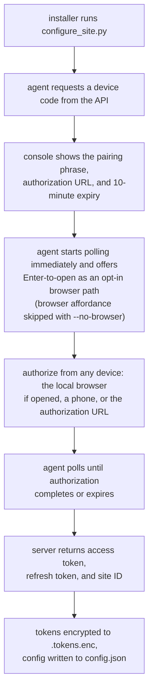

1. Interactive packaged installer for a single machine
2. Silent packaged installer with `/ADD=` for bulk enrollment
3. Remote deployment to machines that already run the agent
4. Manual packaged repair or source-development setup

---

## method 1: interactive packaged install

Download the packaged installer, run it as Administrator, and authorize the machine with the device-code pairing flow.

### steps

1. Log into the owlette dashboard.
2. Click the download button in the header bar.
3. Save `Owlette-Installer-v<version>.exe` to the target machine.
4. Right-click the installer and select **Run as administrator**.
5. Follow the installer wizard.
6. When the console appears, the agent prints the pairing phrase and authorization URL, then immediately begins waiting for authorization.
7. Press Enter only if you want to open the pairing page in the local browser, or authorize from another device by visiting the displayed URL and entering the phrase. The agent is already polling, so pairing completes within seconds of approval.
8. The agent stores credentials and installs the Windows service.
9. On the final wizard page, leave **open owlette** checked and click Finish to bring up the local window. Silent installs skip this and never open a window.

Pairing phrases expire after 10 minutes. Credentials are stored encrypted at `C:\ProgramData\Owlette\.tokens.enc`.

> **Kiosks, signage, media servers, and headless or RDP machines:** leave the prompt unanswered, or set `OWLETTE_NO_BROWSER=1` before launching the installer to hide the local-browser prompt entirely. The agent still starts polling immediately, and you authorize from your phone or another computer. When re-pairing manually, pass `--no-browser` to `configure_site.py` for the same effect.

---

## method 2: silent install with `/ADD=`

Use this path for bulk deployment when an admin has already generated and authorized a pairing phrase.


### steps

1. In the dashboard, click the `+` button next to the view toggle.
2. Open **Generate Code**.
3. Copy the pairing phrase, for example `silver-compass-drift`.
4. Run the installer on each target machine:

```cmd
Owlette-Installer-v<version>.exe /ADD=silver-compass-drift /SILENT
```

For a fully quiet install:

```cmd
Owlette-Installer-v<version>.exe /ADD=silver-compass-drift /VERYSILENT /SUPPRESSMSGBOXES /NORESTART
```

The installer passes `/ADD=` to `configure_site.py --add`. The agent polls `/api/agent/auth/device-code/poll` with the phrase and completes as soon as the server returns tokens.

### installer flags

| flag | description |
|------|-------------|
| `/ADD=phrase` | Preauthorized pairing phrase for silent enrollment |
| `/SERVER=prod` | Use `https://owlette.app/api`; this is the default |
| `/SERVER=dev` | Use `https://dev.owlette.app/api` |
| `/OPENBROWSER=1` | Open the pairing page immediately instead of waiting for Enter |
| `/SILENT` | Minimal UI with progress only |
| `/VERYSILENT` | No installer UI |
| `/SUPPRESSMSGBOXES` | Suppress message boxes |
| `/DIR="C:\path"` | Custom install directory |
| `/NORESTART` | Do not restart after installation |
| `/LOG="C:\path\setup.log"` | Write an Inno Setup log to the chosen path |

Example for the dev environment:

```cmd
Owlette-Installer-v<version>.exe /SERVER=dev /ADD=silver-compass-drift /VERYSILENT /SUPPRESSMSGBOXES /NORESTART
```

---

## method 3: remote deployment or upgrade

Remote deployment requires a target machine that already has a running owlette agent. The agent receives an `install_software` command, downloads the installer, verifies its SHA-256 checksum, and then executes it with the provided silent flags.

Required fields for an owlette agent upgrade:

| field | required | notes |
|-------|----------|-------|
| `installer_url` | yes | Direct URL to the installer `.exe` |
| `installer_name` | no | Defaults to `installer.exe` when omitted |
| `silent_flags` | no | Use installer flags such as `/VERYSILENT /SUPPRESSMSGBOXES /NORESTART` |
| `sha256_checksum` | yes | 64-character SHA-256 of the installer; the agent refuses remote installs without it |
| `verify_path` | no | Optional path checked after installation |
| `timeout_seconds` | no | Defaults to 2400 seconds |

Example command payload:

```json
{
  "installer_url": "https://downloads.example.com/Owlette-Installer-v<version>.exe",
  "installer_name": "Owlette-Installer-v<version>.exe",
  "silent_flags": "/VERYSILENT /SUPPRESSMSGBOXES /NORESTART /SERVER=prod",
  "sha256_checksum": "<64-character sha256>",
  "verify_path": "C:\\ProgramData\\Owlette\\agent\\src\\owlette_service.py",
  "timeout_seconds": 2400
}
```

In the dashboard deployment flow, provide the installer URL, silent flags, optional verify path from a preset/template when available, and target machines. The dialog computes `sha256_checksum` server-side as soon as an installer URL is entered, and falls back to a manual hex field for URLs the web server cannot reach; a deployment cannot be submitted without one.

---

## method 4: manual packaged repair or source development

There are two distinct manual flows.

### packaged installer layout

Use this only on a machine that already has the packaged layout under `C:\ProgramData\Owlette`. The service installer script expects embedded Python, the service host, scripts, and agent source in that layout:

- `C:\ProgramData\Owlette\python\python.exe`
- `C:\ProgramData\Owlette\tools\owlette-host.exe`
- `C:\ProgramData\Owlette\scripts\install.bat`
- `C:\ProgramData\Owlette\agent\src\owlette_runner.py`

To re-run pairing, open the owlette window on the machine and choose **join site** — from the app menu, or from the button in the status bar when the machine belongs to no site. A machine that still belongs to a site shows **leave site** there instead: leave first, then join. Both run the same pairing helper the installer does.

The console equivalent:

```cmd
cd /d C:\ProgramData\Owlette
python\python.exe agent\src\configure_site.py
```

To repair the Windows service registration:

```cmd
cd /d C:\ProgramData\Owlette
scripts\install.bat
```

### source clone for development

A raw source clone does not include the packaged `python\`, `tools\`, or installed service layout. Use it for development, testing, or building a new installer package:

```cmd
git clone https://github.com/theexperiential/owlette.git
cd owlette\agent
python -m pip install -r requirements.txt
```

Do not run `agent\scripts\install.bat` directly from a raw clone unless you have first built or staged the same packaged layout that the installer creates.

---

## how pairing works

The installer runs `configure_site.py` after copying files and before installing the service, unless an existing valid site configuration is already present.



Authorization options:

| method | when to use |
|--------|-------------|
| Local browser | Single-machine install when the target machine has a usable browser - press Enter to open the pairing page |
| Another device (`--no-browser`) | Headless/RDP machines, or kiosks showing live content - set `OWLETTE_NO_BROWSER=1` (or pass `--no-browser`) and authorize from your phone or another computer |
| `/ADD=` | Bulk install with a preauthorized phrase |

---

## post-installation verification

After installation, verify the agent is running.

### check windows services

1. Open Services (`Win + R`, then `services.msc`).
2. Find `OwletteService`.
3. Confirm the status is **Running**.

### check logs

```text
C:\ProgramData\Owlette\logs\service.log
C:\ProgramData\Owlette\logs\service_host.log
C:\ProgramData\Owlette\logs\service_stdout.log
C:\ProgramData\Owlette\logs\service_stderr.log
C:\ProgramData\Owlette\logs\pairing_debug.log
```

`service_host.log` is owlette-host's own log: service registration, agent spawns, exit codes, restart backoff, and stop escalations. `service_stdout.log` and `service_stderr.log` are the supervised agent's raw output.

Useful startup lines include:

```text
OWLETTE AGENT STARTING - v<version>
STARTUP COMPLETE
Firebase client initialized for site: <site_id>
Firebase client started successfully
owlette initialized
```

### check dashboard

The machine should appear in the selected site with:

- Online status
- CPU, memory, and disk metrics
- Agent version

### check system tray

The owlette service launches the desktop app in tray mode as soon as an interactive session is available, so the tray icon appears without anyone starting it by hand. The installer also adds a startup shortcut for the installing user; that shortcut is what the **start on login** toggle in the app menu and the tray's right-click menu switches on and off, and turning it off never touches the service. If the icon is not visible, check the hidden-icons overflow menu or launch **Owlette** from the Start menu.

---

## uninstallation

Use **Windows Settings** > **Apps** > **owlette** > **Uninstall**.

The uninstaller:

1. Closes the desktop app.
2. Stops and deregisters `OwletteService` by running `tools\owlette-host.exe uninstall`, which waits for the service to fully stop so the agent can report itself offline first.
3. Removes the Windows Defender exclusions added by the installer.
4. Removes installed component directories: `python\`, `agent\`, `app\`, `tools\`, and `scripts\`.
5. Removes installed top-level files such as `README.md` and `LICENSE`.

By default, it preserves user data under `C:\ProgramData\Owlette`, including:

- `config\`
- `logs\`
- `cache\`
- `tmp\`
- `.tokens.enc`

In non-silent uninstall mode, the uninstaller asks whether to remove all owlette configuration and data files. Accept that prompt only when you want a full cleanup. Silent uninstalls preserve data for upgrade and repair flows.

---

## installer details

The owlette installer is built with [Inno Setup](https://jrsoftware.org/isinfo.php) and bundles:

| component | purpose |
|-----------|---------|
| Embedded Python | Python runtime; no system Python is needed for packaged installs |
| owlette-host | Windows service host at `C:\ProgramData\Owlette\tools\owlette-host.exe` — registers, starts, stops, and supervises `OwletteService` (replaced NSSM in 3.0.0) |
| Agent source | Python modules under `C:\ProgramData\Owlette\agent\src\` |
| Desktop app | `C:\ProgramData\Owlette\app\owlette-desktop.exe` — the local configuration window and the tray icon, in one process |
| WebView2 runtime | Microsoft's Evergreen bootstrapper, run only on machines that lack the runtime the desktop app renders in (common on LTSC/IoT kiosk images) |

---

## system requirements

| requirement | minimum |
|-------------|---------|
| OS | Windows 10 or later, 64-bit |
| RAM | 50 MB agent overhead |
| Disk | About 200 MB including embedded Python |
| Network | Access to the configured owlette API and Firebase services |
| Permissions | Administrator privileges for service installation |
