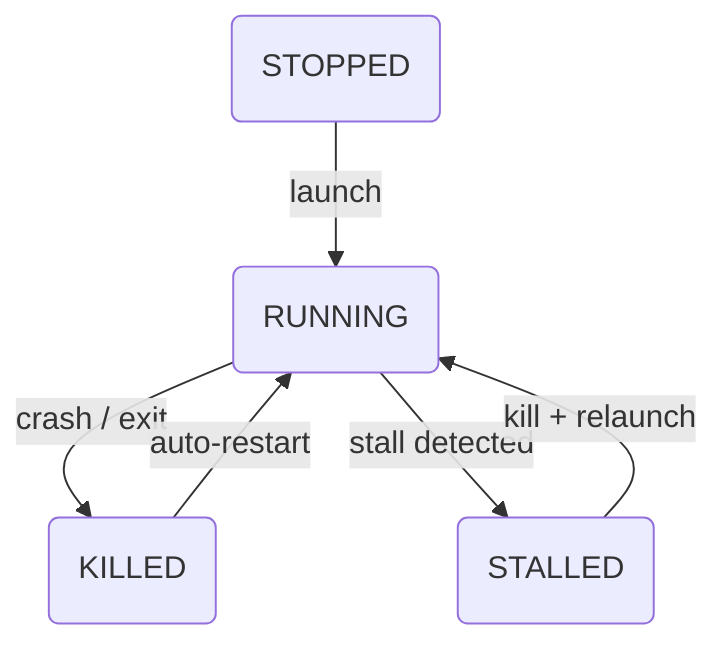

---

## process state machine

The agent reports these process statuses. This diagram shows the common managed-process path:



### state definitions

| state | description | dashboard indicator |
|-------|-------------|---------------------|
| **RUNNING** | Process is alive and responsive | Green |
| **LAUNCHING** | Launch is in progress | Yellow |
| **QUEUED** | Launch is queued or waiting for a delay | Yellow |
| **LAUNCH_FAILED** | Launch failed | Red |
| **STALLED** | Process exists but is not responding (hang detected) | Yellow |
| **KILLED** | Process was terminated (manually or by agent) | Red |
| **STOPPED** | Launch mode is active, but no running PID/runtime data is present | Red |
| **INACTIVE** | Launch mode is `off` | Slate/grey |

---

## monitoring loop

Every 5 seconds, the agent runs through all configured processes:

### 1. check if process is running

The monitoring loop validates the process by:

1. **PID check** — Is there a process with the stored PID?
2. **Status update** — Keep it RUNNING when the PID is live, or treat a disappeared PID as an unexpected stop when launch mode is still active.

PID recovery validates the executable path before adopting an existing process, which prevents PID reuse false positives during startup recovery.

### 2. crash detection

A process is considered unexpectedly stopped when:

- Its stored PID no longer exists.
- Launch mode is still active, so the agent can relaunch it within the configured restart budget.

### 3. hang detection (multi-stage)

The agent uses a progressive approach to detect frozen applications:

| stage | time | action |
|-------|------|--------|
| **Startup grace** | First 60s after launch | Skip responsiveness checks |
| **Probe** | Every ~5s after grace | `owlette_scout.py` enumerates windows for the PID and uses `IsHungAppWindow` |
| **Monitor** | Before 15s | Mark the process as STALLED, but keep waiting through repeated 5-second checks |
| **Confirmation** | 15s+ | If the process has stayed unresponsive for `HANG_CONFIRM_SECONDS`, kill and relaunch it |

The agent does not kill on the first failed responsiveness check; it waits until the process has been unresponsive for 15 seconds after the startup grace period.

### 4. auto-restart

When a crash is detected and launch mode is active:

1. Agent increments the **relaunch counter**
2. If under the limit (`relaunch_attempts`), restart the process
3. Wait `time_delay` seconds before starting
4. Wait `time_to_init` seconds before monitoring responsiveness
5. If at the limit, show a **reboot prompt** to the user

If PID detection fails after launch, retry attempts wait for at least `time_to_init`, with a 60-second minimum cooldown for slow-starting applications.

If the configured `exe_path` does not exist, the agent does not attempt to launch the process. On the transition into that failed state, it scans nearby sibling directories for executable paths with the same basename, sends an `exe_missing` alert with suggested paths, and writes a `process_launch_failed` log event. The alert is rate-limited by the same failed-launch marker so it does not repeat every monitoring tick.

---

## process launch methods

Managed process launch uses `CreateProcessAsUser` to start `process_launcher.py` in the logged-in user session:

```
Agent gets user token (WTSQueryUserToken)
    → CreateProcessAsUser starts process_launcher.py
    → process_launcher.py uses ShellExecuteEx for visible windows
    → process_launcher.py uses subprocess.Popen for hidden launches
```

Task Scheduler is used by self-update, not as the normal managed-process launch path.

---

## pid recovery

When the service restarts, it doesn't re-launch processes that are already running. Instead, it **recovers** existing PIDs:

1. For each configured process, scan running processes for matching `exe_path`
2. If found, adopt the PID — mark as RUNNING without relaunching
3. If not found and launch mode is active, start the process

This prevents duplicate instances after service restarts or crashes.

---

## relaunch limits

Each process has a configurable `relaunch_attempts` limit (default: 3). When the limit is reached:

1. The agent stops trying to restart the process
2. A **reboot countdown prompt** appears on screen (`prompt_restart.py`)
3. The user can dismiss the prompt or allow the reboot
4. The relaunch counter resets after a successful process start or manual intervention

<Callout type="idea" title={"Crash alerts"}>

When a process crashes, the agent reports the event to the web dashboard via the alert API. Agent code uses `firebase_client.send_alert(event_type, data)` as the canonical alert sender; older process/display helpers delegate to it. Failed sends are queued in memory and retried after reconnect, capped at 100 pending alerts. If email alerts are configured for the site, the dashboard sends a **process crash alert** email including the process name, machine name, and error details. Webhooks are also triggered if configured.

</Callout>
---

## metrics collection

At each heartbeat interval, the agent collects and reports (5s when the system tray is open, 30s when processes are active, 120s when idle):

| metric | source | description |
|--------|--------|-------------|
| **CPU** | `psutil.cpu_percent()` | Overall CPU usage percentage |
| **Memory** | `psutil.virtual_memory()` | RAM usage percentage |
| **Disk** | `psutil.disk_usage('/')` | Primary disk usage percentage |
| **GPU** | GPUtil | GPU usage and VRAM percentage (if available) |
| **CPU Model** | Registry/psutil | CPU model name (e.g., "Intel Core i9-9900X") |
| **Processes** | Per-process | Status, PID, uptime for each configured process |

GPU monitoring uses separate sources for usage and temperature:

- **GPU usage/VRAM**: GPUtil
- **GPU temperature**: WinTmp, then pynvml/NVML
- **No GPU**: Gracefully returns 0
