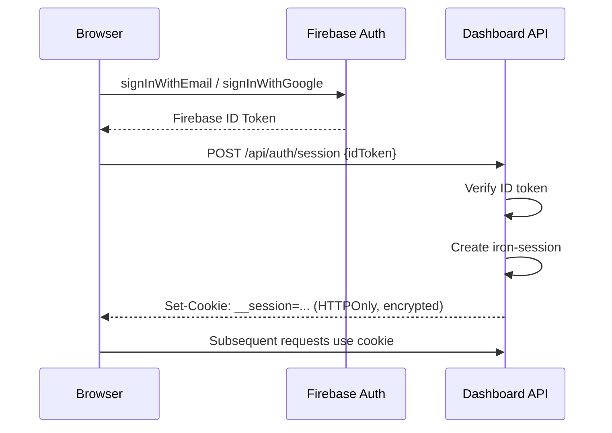
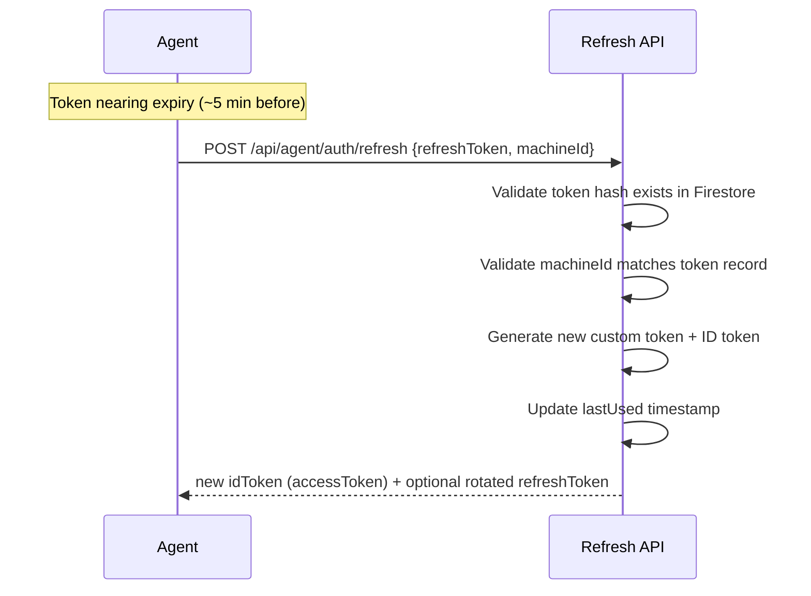
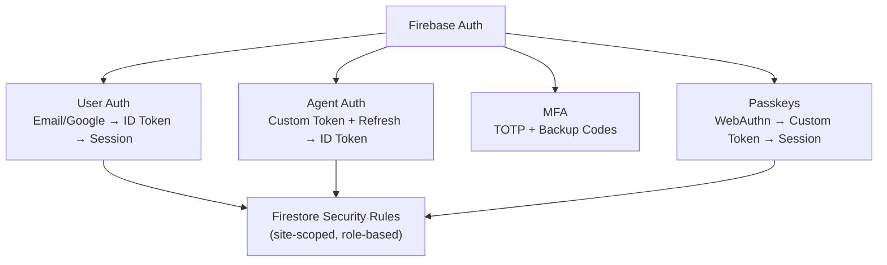

Owlette uses four authentication mechanisms: user auth (Firebase Auth), agent auth (device code pairing), passkey authentication (WebAuthn), and optional MFA (TOTP).

---

## user authentication

### sign-in flow



### session management

Sessions use [iron-session](https://github.com/vvo/iron-session) — encrypted, signed, HTTPOnly cookies.

| property | value |
|----------|-------|
| **Cookie name** | `__session` |
| **HTTPOnly** | Yes (not accessible from JavaScript) |
| **Secure** | Yes (HTTPS only in production) |
| **Encryption** | AES-256-GCM via `SESSION_SECRET` |

### sign-out

`DELETE /api/auth/session` clears the session cookie.

---

## agent authentication (device code pairing)

Agents authenticate using a device code flow with a two-token system. No Firebase service account keys are stored on client machines.

### pairing flow

```
1. Agent requests pairing phrase (POST /api/agent/auth/device-code)
   └── Server generates 3-word phrase (e.g., "silver-compass-drift")
       stored in device_codes/{phrase} with 10-minute expiry

2. User authorizes (POST /api/agent/auth/device-code/authorize)
   ├── Via browser auto-opened on the machine (owlette.app/add)
   ├── Via dashboard "+" button → "Enter Code" tab
   ├── Via /ADD=phrase installer flag (pre-authorized, no interaction)
   ├── Server creates Firebase custom token with claims:
   │     {role: "agent", site_id: "...", machine_id: "..."}
   ├── Server exchanges custom token for ID token (Firebase Auth REST)
   ├── Server generates refresh token (random, hashed in Firestore)
   └── Stores the prepared credential bundle in the device_codes doc
       (encrypted blob for interactive pairing, plaintext for pre-authorized)

3. Agent polls for authorization (POST /api/agent/auth/device-code/poll)
   ├── Server reads the stored credential bundle from the device_codes doc
   ├── Returns it (encrypted blob for interactive pairing, plaintext
   │     accessToken + refreshToken + siteId for pre-authorized codes)
   └── Deletes the device-code doc

4. Agent stores tokens
   ├── Access token: used for Firestore REST API calls (1-hour expiry)
   └── Refresh token: encrypted locally with Fernet AES (machine-bound key)
```

### add machine modal (dashboard)

Operators can pair machines without using the installer's browser handoff by clicking the **"+"** button on the dashboard header. The `AddMachineButton` modal (see `web/app/dashboard/components/AddMachineButton.tsx`) exposes two tabs:

**Enter Code** — for operators who already have a pairing phrase (e.g. the installer's GUI is showing `silver-compass-drift` on the target machine):

1. Type the three-word phrase into the input
2. Click **Authorize**
3. The modal `POST`s to `/api/agent/auth/device-code/authorize` with the current `siteId` — the agent's pending poll sees the authorization and completes pairing

**Generate Code** — for bulk or silent deployments where no one will be at the machine:

1. Click **Generate Pairing Phrase** — the modal calls `POST /api/agent/auth/device-code` then immediately authorizes the returned phrase for the current site (`POST /api/agent/auth/device-code/authorize`)
2. Copy the pre-authorized phrase, or copy the silent install command, which the modal formats as:

   `Owlette-Installer-v{version}.exe /ADD={phrase} /SILENT`

3. The phrase expires **10 minutes** after generation. Run the command on each target machine within that window and the agent will pair on first launch — no GUI, no browser.

Both tabs work only while the viewer has write access to the currently-selected site.

---

### token refresh flow



### token security

| aspect | implementation |
|--------|---------------|
| **Refresh token storage** | Encrypted with Fernet AES, key derived from Windows `MachineGuid` |
| **Refresh token in Firestore** | Stored as SHA-256 hash (not plaintext) |
| **ID token lifetime** | 1 hour (Firebase custom token) |
| **Machine binding** | Refresh validates `machineId` matches — prevents token theft |
| **Token collections** | `device_codes`, `agent_tokens`, and `agent_refresh_tokens` are server-side only (no client access) |

### custom token claims

```json
{
  "role": "agent",
  "site_id": "nyc-office",
  "machine_id": "DESKTOP-ABC123"
}
```

Firestore security rules use these claims to scope agent access to a single site and machine.

---

## passkey authentication (webauthn)

Passkeys use the Web Authentication API (FIDO2) for passwordless login. A passkey replaces both the password and 2FA — it's a single biometric/PIN step.

### registration flow

```
1. User is logged in, navigates to passkey management
   └── POST /api/passkeys/register/options
       ├── Generate WebAuthn registration challenge
       ├── Store in webauthn_challenges/{userId} (10-min expiry)
       └── Return PublicKeyCredentialCreationOptions

2. Browser prompts for authenticator (Touch ID, Windows Hello, phone)

3. User completes biometric/PIN
   └── POST /api/passkeys/register/verify
       ├── Verify attestation response
       ├── Store credential in users/{userId}/passkeys/{credentialId}
       ├── Set passkeyEnrolled: true on user document
       └── Delete challenge
```

### login with passkey

```
1. User clicks "passkey" on login page
   └── POST /api/passkeys/authenticate/options
       ├── Generate authentication challenge (discoverable)
       ├── Store in webauthn_challenges/{randomId} (10-min expiry)
       └── Return options + challengeId

2. Browser shows available passkeys for this site
   └── User selects and authenticates (biometric/PIN)

3. POST /api/passkeys/authenticate/verify
   ├── Verify assertion response against stored public key
   ├── Validate counter (clone detection)
   ├── Create iron-session (HTTPOnly cookie)
   ├── Create Firebase custom token
   ├── Client calls signInWithCustomToken()
   └── MFA is bypassed (passkey IS the second factor)
```

### passkey management

- Users can register multiple passkeys (e.g., laptop + phone)
- Each passkey has a friendly name, device type, creation date, last used date
- Rename: `PATCH /api/passkeys/{credentialId}`
- Delete: `DELETE /api/passkeys/{credentialId}`
- List: `GET /api/passkeys/list?userId=...`

### security

| aspect | implementation |
|--------|---------------|
| **RP ID** | `owlette.app` (prod), `localhost` (dev) |
| **Challenge lifetime** | 10 minutes, single-use, deleted after verification |
| **Clone detection** | Counter validation — rejects if response counter ≤ stored counter |
| **Credential storage** | Public key in `users/{userId}/passkeys/` subcollection |
| **User verification** | `required` (PIN or biometric mandatory) |
| **Discoverable credentials** | `residentKey: preferred` (no email needed to start login) |

---

## multi-factor authentication (mfa)

Optional TOTP-based two-factor authentication. Passkey login bypasses MFA entirely.

### setup flow

```
1. User initiates 2FA setup
   └── POST /api/mfa/setup
       ├── Generate TOTP secret
       ├── Store in mfa_pending/{userId} (10-min expiry)
       └── Return secret + QR code URL

2. User scans QR with authenticator app

3. User enters 6-digit code
   └── POST /api/mfa/verify-setup
       ├── Verify code against secret
       ├── Encrypt secret → store in users/{userId}
       ├── Receive client-generated backup codes → hash and store
       └── Delete mfa_pending document

4. MFA is now active for this user

5. (Optional) User registers a passkey for faster future logins
```

### login with mfa

```
1. User logs in normally (email/password or Google)
2. Dashboard detects mfaEnrolled: true on user document
3. Prompt for TOTP code
4. POST /api/mfa/verify-login {code}
   ├── Decrypt secret from user document
   ├── Verify TOTP code (or check backup codes)
   ├── If backup code used: remove from list
   └── Return success
```

### backup codes

- 10 backup codes generated during setup
- Each is single-use
- Stored as hashed values in Firestore
- Used when authenticator device is unavailable

---

## role-based access control

Owlette uses a three-tier model for human users (plus a separate agent tier for service accounts):

### roles

| role | platform | site access | typical usage |
|------|----------|-------------|---------------|
| **member** | none | read-only on assigned sites | viewers, read-only ops |
| **admin** | none | write on assigned sites (reboot, delete machines, edit display layouts, site settings) | site operators delegated by platform admins |
| **superadmin** | full Admin Panel (user management, installer uploads, etc.) | implicit access to every site | platform administrators |
| **agent** | — | single site + single machine (custom token claims) | Owlette agent service accounts |

New users default to `member`. Superadmins promote members to `admin` or `superadmin` from `/admin/users`.

### enforcement layers

1. **Firestore Security Rules** — Database-level enforcement (cannot be bypassed). Helpers: `isSuperadmin()`, `isSiteAdmin(siteId)`, `canAccessSite(siteId)`. See [firestore-rules.md](/docs/setup/firestore-rules#key-functions).
2. **API Route Middleware** — Server-side helpers resolve sessions, Firebase ID tokens, and `owk_*` API keys. Public API routes use resource-scoped helpers such as `requireSiteAuthAndScope`, `requireMachineAuthAndScope`, `requireChatAuthAndScope`, and lower-level `resolveAuth`/`requireScope`; roost-specific routes use the same scoped-auth pattern. `requireAdminOrIdToken` is reserved for legacy or superadmin-gated platform routes.
3. **React Components** — `RequireSuperadmin` for platform-scoped routes; `useAuth().isSiteAdmin(siteId)` for site-scoped UI gates.

### how role is determined

```
User logs in → Firebase Auth ID token
  │
  POST /api/auth/session → Server creates the iron-session cookie
  │     (userId + MFA state only — the cookie does NOT carry role)
  │
  └── AuthContext separately subscribes to users/{uid} in Firestore
        via onSnapshot → reads the live role field there
```

---

## security architecture


